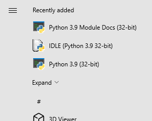

# Sample: MSIX PSF - Create config.json with command line arguments extracted from app Shortcuts 

## PowerShell Script: ShortCutToConfig.ps1

## Requirements:

1. A desktop Windows application packaged with MSIX. The [MSIX Packaging tool](https://www.microsoft.com/en-us/p/msix-packaging-tool/9n5lw3jbcxkf) (MPT) is a great tool for this purpose.
1. AppxManifest.xml extracted from the MSIX. Use your favorite zip utility to do this.
2. All Shortcut files (*.LNK) (created when the app is installed via MSI). Tip: These are created when you package the app with MPT.
3. All files (AppxManifest.xml and the *.LNK files) should be in the same folder as this script.

## Introduction

The [Package Support Framework](https://github.com/Microsoft/MSIX-PackageSupportFramework/) (PSF) is a powerful tool for extending the capabilities of out-of-the-box MSIX. For example, you can run PowerShell scripts, add fix ups that can change the current working directory or re-route file writes - without having to modify the application itself. 

Some packaging scenarios require reusing the same executable with different command line arguments to in-effect, present a different app to the user.  Others require the app be started with command line arguments to properly initialize. Take for example the command lines for Python 3.9:

This command line starts the Python IDE:

```pythonw.exe Lib\idlelib\idle.pyw```

This command line starts the Python Documentation:

```python.exe  -m pydoc -b```

This command line starts the Python CLI:

```python.exe```

If you're familiar with Python on Windows, you may have noticed that three shortcuts are available:



However, after packaging as MSIX and installing, only two entries are in the Start menu. Specifically the Python Docs icon is missing. When running MPT to convert the MSI to an MSIX package, **python.exe** and **pythonw.exe** are detected and added to the manifest. However it does not add apps that require unique command lines. We will use PSF to enable this senario.

## ShortCutToConfig.ps1

This script:
1. Creates an AppxManifestNew.xml which contains:

* Additional applications as needed for the multiple non-unique executables

* Replaces the Executable element in the Application defintion with ```PsfLauncher32/64.exe```

2. Creates config.txt which contains an ```application``` definition for each app launch scenario including the command line parameters. 

```
{
    "applications": [
        {
            "id": "",
            "executable": "",
            "arguments": ""
        }
    ]
}
```

It does this by reading the shortcut files (.LNK) and reconciling the manifest and config.json with the needed entries.

## Putting it all together - Integrate PSF

Use the MSIX Packaging tool to modify the original MSIX to include the manifest and add the PSF binaries.
1. Right click the MSIX in File Explorer and select, ```Edit with MSIX Packaging Tool```.
2. Open the Manifest file and replace the contents with the contents of ```AppxManifestNew.xml``` created with ShortCutToConfig.ps1. 
3. In the ```Package files``` tab of the MPT, add the PSF Binaries and config.json file. For more information on integrating PSF, see [here](https://docs.microsoft.com/en-us/windows/msix/psf/create-shortcut-with-script-package-support-framework#get-the-psf-files). After adding the PSF binaries and config.json to the root of the package, the layout should look something like this:
```txt
├── AppName
│   ├── AppName.exe
├── PsfLauncher32.exe
├── PsfLauncher64.exe
├── PsfRunDll32.exe
├── PsfRunDll64.exe
├── PsfRuntime32.dll
├── PsfRuntime64.dll
└── config.json
```
4. Add the signing certificate and password and save the MSIX.

## Test it

After installing the MSIX, you will see all three Start menu entries. When selected, they will properly start the application with the appropriate command line.
